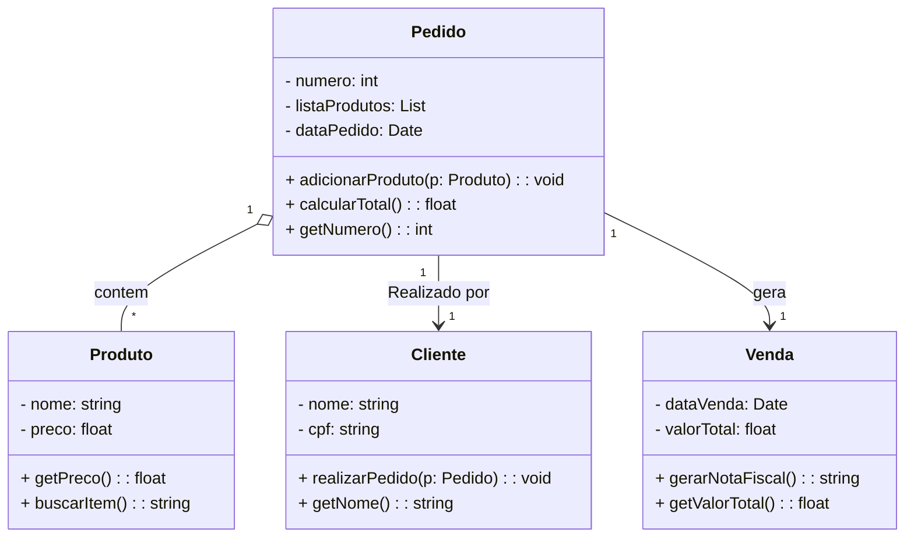

```mermaid
classDiagram
  class Pedido {
    - numero: int
    - listaProdutos: List<Produto>
    - dataPedido: Date
    + adicionarProduto(p: Produto): void
    + calcularTotal(): float
    + getNumero(): int
  }

  class Cliente {
    - nome: string
    - cpf: string
    + realizarPedido(p: Pedido): void
    + getNome(): string
  }

  class Venda {
    - dataVenda: Date
    - valorTotal: float
    + gerarNotaFiscal(): string
    + getValorTotal(): float
  }

  class Produto {
    - nome: string
    - preco: float
    + getPreco(): float
    + buscarItem(): string
  }

  Pedido "1" o-- "*" Produto : contem
  Pedido "1" --> "1" Cliente : Realizado por
  Pedido "1" --> "1" Venda : gera
```
