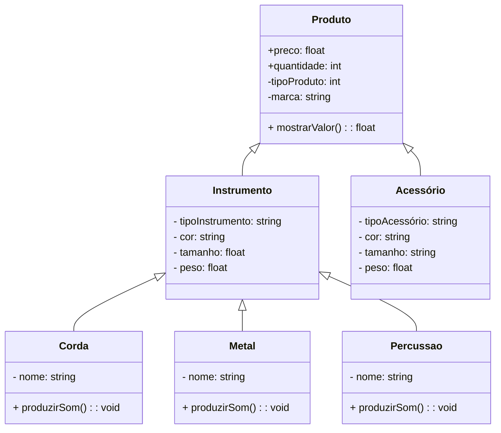

```mermaid
classDiagram
  class Produto {
  +preco: float
  +quantidade: int
  -tipoProduto: int
  -marca: string
  + mostrarValor(): float
}
  class Instrumento {
  - tipoInstrumento: string
  - cor: string
  - tamanho: float
  - peso: float
}
  class Acessório {
  - tipoAcessório: string
  - cor: string
  - tamanho: string
  - peso: float
  }
Produto <|-- Instrumento
Produto <|-- Acessório

  class Corda {
  - nome: string
  + produzirSom(): void
}
  class Metal {
  - nome: string
  + produzirSom(): void
}
  class Percussao {
  - nome: string
  + produzirSom(): void
}

Instrumento <|-- Corda
Instrumento <|-- Metal
Instrumento <|-- Percussao

```
