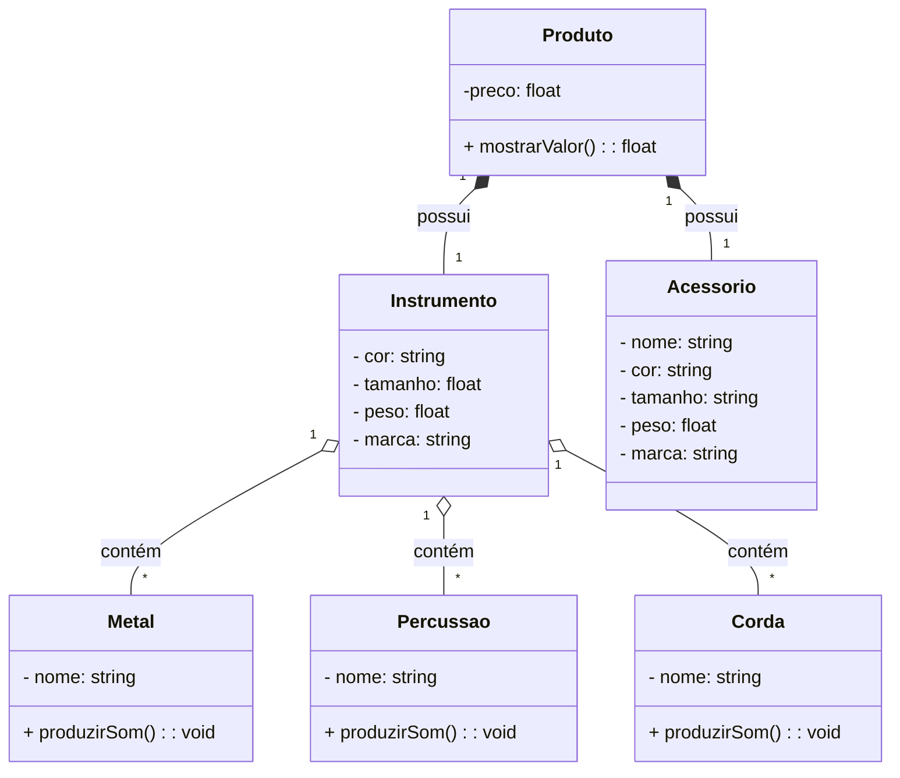

```mermaid
classDiagram
  class Produto {
  -preco: float
  + mostrarValor(): float
}
  class Instrumento {
  - cor: string
  - tamanho: float
  - peso: float
  - marca: string
}
  class Acessorio {
  - nome: string
  - cor: string
  - tamanho: string
  - peso: float
  - marca: string
  }

  class Corda {
  - nome: string
  + produzirSom(): void
}
  class Metal {
  - nome: string
  + produzirSom(): void
}
  class Percussao {
  - nome: string
  + produzirSom(): void
}


Instrumento "1" o-- "*" Metal: contém
Instrumento "1" o-- "*" Percussao: contém
Instrumento "1" o-- "*" Corda: contém
Produto "1" *-- "1" Instrumento: possui
Produto "1" *-- "1" Acessorio: possui
```
