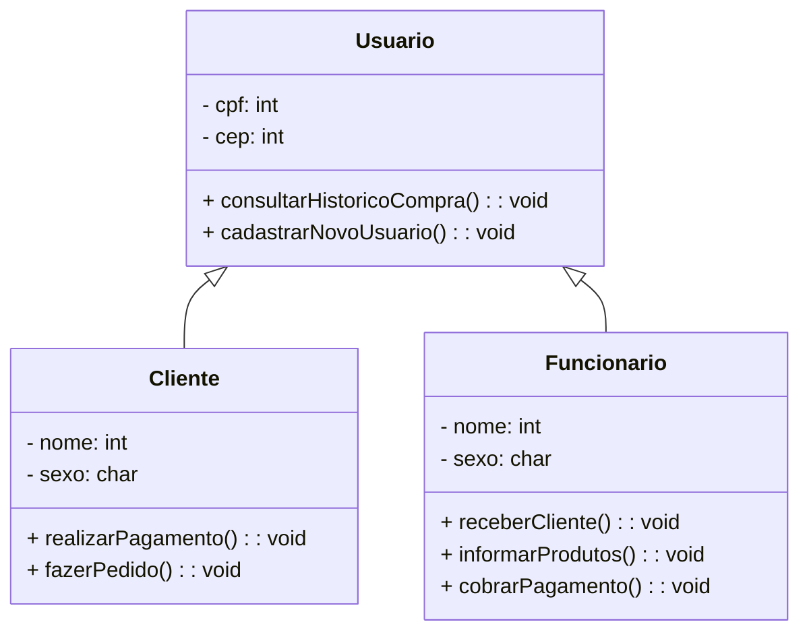

```mermaid
classDiagram
  class Usuario {
  - cpf: int
  - cep: int
  + consultarHistoricoCompra(): void
  + cadastrarNovoUsuario(): void
}

  class Cliente {
  - nome: int
  - sexo: char
  + realizarPagamento(): void
  + fazerPedido(): void
}

  class Funcionario {
  - nome: int
  - sexo: char
  + receberCliente(): void
  + informarProdutos(): void
  + cobrarPagamento(): void
}

Usuario <|-- Cliente
Usuario <|-- Funcionario
```
